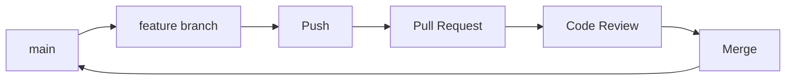

# Módulo 2: Branching y Colaboración

**Objetivo**: Dominar ramas, fusiones y trabajo colaborativo con Git.

---

## Branching

### Concepto
Las ramas (branches) permiten desarrollar funcionalidades de forma aislada.

### Gestión de Ramas
```powershell
# Listar ramas
git branch
git branch -a  # Incluyendo remotas

# Crear rama
git branch feature/login

# Cambiar de rama
git checkout feature/login
git switch feature/login  # Alternativa moderna

# Crear y cambiar (un solo comando)
git checkout -b feature/login
git switch -c feature/login
```

### Fusionar (Merge)
```powershell
# Fusionar feature en main
git checkout main
git merge feature/login

# Si hay conflictos, resolverlos manualmente y:
git add .
git commit -m "Resolve merge conflicts"
```

---

## Trabajo con Remotos

### Conectar Repositorio Remoto
```powershell
# Añadir remoto
git remote add origin https://github.com/usuario/repo.git

# Ver remotos
git remote -v
```

### Sincronizar
```powershell
# Subir cambios
git push origin main

# Bajar cambios
git pull origin main

# Clonar repositorio
git clone https://github.com/usuario/repo.git
```

---

## Pull Requests y Code Review

### Flujo de Trabajo Colaborativo


### Buenas Prácticas
- Commits pequeños y descriptivos
- Una rama por funcionalidad
- Pull requests con descripción clara
- Revisar código antes de mergear

---

## Resolución de Conflictos

Cuando dos ramas modifican las mismas líneas:

1. `git merge` muestra CONFLICT
2. Abre el archivo y busca marcadores `<<<<<<<`, `=======`, `>>>>>>>`
3. Edita para mantener el código correcto
4. Elimina los marcadores
5. `git add` y `git commit`

```powershell
# Si necesitas abortar el merge
git merge --abort
```

---

## Comandos Útiles

```powershell
# Guardar cambios temporales
git stash
git stash pop

# Rebase (reorganizar commits)
git rebase main

# Deshacer último commit (sin perder cambios)
git reset --soft HEAD~1

# Deshacer cambios locales
git checkout -- archivo.js
git restore archivo.js
```

---

**Documentación oficial**: https://git-scm.com/doc
**Siguiente**: [[03 - Módulo 3 - Estrategias Avanzadas|Módulo 3: Estrategias Avanzadas]]
**Inicio herramienta**: [[git|Git]]
**Inicio principal**: [[../../00 - Índice/Índice General]]
