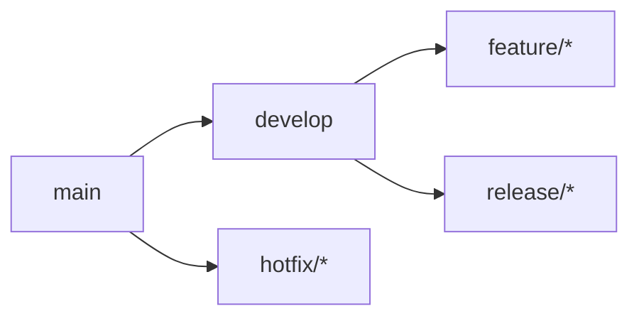

# Módulo 3: Estrategias Avanzadas

**Objetivo**: Dominar estrategias de branching, automatización y buenas prácticas profesionales.

---

## Estrategias de Branching

### Git Flow

- `main`: Producción
- `develop`: Integración
- `feature/*`: Nuevas funcionalidades
- `release/*`: Preparación de releases
- `hotfix/*`: Correcciones urgentes

### GitHub Flow
- `main` siempre desplegable
- Ramas de funcionalidad desde `main`
- Pull requests para revisión
- Despliegue inmediato tras merge

### Conventional Commits
```
feat: añadir sistema de autenticación
fix: corregir error en cálculo de total
docs: actualizar README con ejemplos
refactor: simplificar lógica de checkout
test: añadir tests para el carrito
chore: actualizar dependencias
```

---

## Automatización con Hooks

### Git Hooks (scripts que se ejecutan en eventos)
```powershell
# .git/hooks/pre-commit
#!/bin/sh
npm run lint
npm test
```

### Husky (Node.js)
```powershell
npx husky init
npx husky add .husky/pre-commit "npm run lint"
```

---

## Integración CI/CD

### GitHub Actions
```yaml
name: CI
on: [push, pull_request]
jobs:
  test:
    runs-on: ubuntu-latest
    steps:
      - uses: actions/checkout@v4
      - run: npm ci
      - run: npm test
      - run: npm run build
```

---

## Git Avanzado

### Bisect (encontrar commits que introducen bugs)
```powershell
git bisect start
git bisect bad HEAD
git bisect good v1.0.0
# Git te guía: marca cada commit como good o bad
git bisect reset
```

### Cherry-pick (aplicar commits específicos)
```powershell
git cherry-pick abc123 def456
```

### Submódulos
```powershell
git submodule add https://github.com/usuario/lib.git libs/lib
git submodule update --init --recursive
```

### Rebase Interactivo
```powershell
# Squash, reordenar, editar commits
git rebase -i HEAD~5
```

---

## Buenas Prácticas Profesionales

1. **Commits atómicos**: Cada commit hace una sola cosa
2. **Mensajes descriptivos**: Usa conventional commits
3. **Protección de ramas**: Bloquear push directo a main
4. **Code review obligatorio**: Mínimo un approval
5. **Tests automatizados**: En cada PR
6. **Documentación**: README, CONTRIBUTING, CHANGELOG

---

**Documentación oficial**: https://git-scm.com/doc
**Siguiente**: [[04 - Módulo 4 - Git Tools - Stash, Reflog y Reescritura|Módulo 4: Git Tools - Stash, Reflog y Reescritura]]
**Inicio herramienta**: [[git|Git]]
**Inicio principal**: [[../../../00 - Índice/Índice General]]
