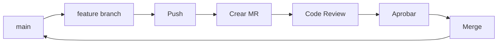

# Módulo 2: Repositorios y Merge Requests

**Objetivo**: Dominar el flujo de trabajo con repositorios GitLab y Merge Requests.

---

## Repositorios en GitLab

### Inicializar y Conectar

```powershell
# Crear repositorio local
git init
git add .
git commit -m "Initial commit"

# Conectar con GitLab
git remote add origin https://gitlab.com/usuario/mi-proyecto.git

# Verificar remoto
git remote -v
```

### Push Inicial

```powershell
# Subir rama principal
git push -u origin main

# Subir todas las ramas
git push --all origin
```

### Clonar Repositorio

```powershell
# Por HTTPS
git clone https://gitlab.com/usuario/repo.git

# Por SSH
git clone git@gitlab.com:usuario/repo.git
```

---

## Merge Requests

### Flujo de Trabajo



### Crear Merge Request

```powershell
# Crear rama de feature
git checkout -b feature/nueva-funcionalidad

# Hacer cambios y commit
git add .
git commit -m "feat: añadir nueva funcionalidad"

# Subir rama
git push -u origin feature/nueva-funcionalidad
```

En GitLab: Merge Requests > New Merge Request

Seleccionar:
- **Source**: `feature/nueva-funcionalidad`
- **Target**: `main`
- **Title**: Descripción clara
- **Description**: Contexto, cambios, screenshots
- **Assignee**: Revisor asignado
- **Reviewers**: Uno o más revisores

### Revisar y Aprobar

| Acción | Descripción |
|--------|-------------|
| **Comment** | Comentario general o en línea |
| **Approve** | Aprueba los cambios |
| **Request Changes** | Solicita correcciones |
| **Resolve Thread** | Marca discusión como resuelta |
| **Merge** | Fusiona cuando está aprobado |

### Tipos de Merge

| Estrategia | Cuándo usarla |
|------------|---------------|
| **Merge Commit** | Preservar historial completo |
| **Squash Merge** | Historial limpio (1 commit) |
| **Fast-Forward Merge** | Sin commits de merge |

---

## Ramas Protegidas

```yaml
# Configuración en Settings > Repository > Protected Branches
branch: main
allowed_to_merge: Maintainers, Developers
allowed_to_push: No one (solo MR)
code_owner_approval_required: true
```

### Code Owners

Archivo `CODEOWNERS` en la raíz del repositorio:

```
# Dueños globales
* @usuario-principal

# Equipo frontend
/src/frontend/ @equipo-frontend

# Equipo backend
/src/api/ @equipo-backend

# Documentación
/docs/ @tech-writer
```

---

## Web IDE

Acceso: `.` en el teclado o botón **Web IDE**

- Editor completo con VSCode en el navegador
- Terminal integrada
- Live Preview
- Git integrado (commit, push, branch)

### Snippets

Fragmentos de código reutilizables:

```python
# Ejemplo de snippet
def saludar(nombre):
    return f"Hola, {nombre}!"
```

- Visibles: Private, Internal, Public
- Formateo syntax highlighting automático

### Wiki

Documentación integrada en el repositorio:

```
wiki/
  ├── home.md
  ├── getting-started.md
  └── api-reference.md
```

- Formato Markdown
- Sidebar personalizable
- Historial de versiones

---

## Resumen del Módulo

| Concepto | Descripción |
|----------|-------------|
| **git remote** | Conectar repo local con GitLab |
| **Merge Request** | Solicitud de fusión con revisión |
| **Protected Branches** | Ramas con reglas de push/merge |
| **Code Owners** | Revisores obligatorios por archivo |
| **Web IDE** | Editor en navegador |
| **Snippets** | Fragmentos de código |
| **Wiki** | Documentación del proyecto |

---

| Navegación | Enlace |
|------------|--------|
| **← Anterior** | [[03 - Control de Versiones y CI-CD/10 - GitLab/01 - Módulo 1 - Fundamentos de GitLab\|Módulo 1 - Fundamentos de GitLab]] |
| **Siguiente →** | [[03 - Módulo 3 - Issues y Planning\|Módulo 3: Issues y Planning]] |
| **Inicio herramienta** | [[gitlab\|GitLab]] |
| **Inicio principal** | [[../../00 - Índice/Índice General\|IÍndice General]] |
| **Documentación oficial** | [GitLab Docs](https://docs.gitlab.com) |

---
