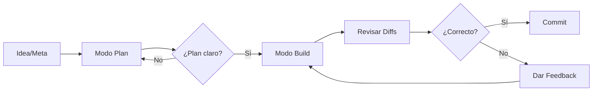

# Módulo 2: Flujo de Trabajo Básico y Modos de Operación

**Objetivo**: Aprender a interactuar con OpenCode para tareas cotidianas de desarrollo.

---

## Modo Plan vs. Modo Build

### Modo Plan (Solo Lectura)
- **Propósito**: Análisis, planificación y exploración del código base
- **Herramientas disponibles**: Lectura de archivos, búsqueda, navegación
- **Herramientas restringidas**: Escritura, edición, ejecución de comandos
- **Cuándo usarlo**:
  - Entender cómo funciona una parte del código
  - Planificar una funcionalidad compleja antes de implementarla
  - Explorar el código base para encontrar patrones
  - Hacer preguntas sobre la arquitectura

### Modo Build (Acceso Total)
- **Propósito**: Implementar cambios, escribir código, ejecutar comandos
- **Herramientas disponibles**: Todas (lectura, escritura, edición, bash)
- **Cuándo usarlo**:
  - Implementar una nueva funcionalidad
  - Corregir bugs
  - Refactorizar código
  - Ejecutar tests y comandos

### Cambio entre modos
Presiona la tecla **Tab** para alternar entre Plan y Build.

---

## Tipos de Interacciones

### Hacer preguntas y entender el código base
```markdown
"¿Cómo funciona el sistema de autenticación en este proyecto?"
"¿Qué archivos están involucrados en el proceso de checkout?"
"Muéstrame la estructura de carpetas del proyecto"
```

### Planificar una funcionalidad compleja
```markdown
(En modo Plan)
"Quiero añadir un sistema de caché para las consultas a la API.
Analiza la estructura actual y propón una implementación."
```

### Implementar cambios
```markdown
(En modo Build)
"Añade un endpoint GET /api/users/:id que devuelva los datos del usuario.
Sigue el mismo patrón que el endpoint de productos existente."
```

### Depurar y refactorizar
```markdown
"El test X está fallando. Revisa el código y encuentra el error."
"Refactoriza este componente para usar hooks en lugar de class components."
```

---

## Gestión de Cambios

### comandos /undo y /redo
- `/undo` - Deshace el último cambio realizado por OpenCode
- `/redo` - Rehace un cambio que fue deshecho
- **Importante**: Solo funciona dentro de la sesión actual

### Iteración sobre feedback
1. Revisa los cambios propuestos
2. Proporciona feedback específico
3. OpenCode ajusta la implementación
4. Repite hasta que el resultado sea satisfactorio

### Buenas prácticas
- Usa el modo **Plan** para funciones complejas antes de implementar
- Revisa siempre los **diffs** antes de aceptar cambios
- Sé específico en tus instrucciones
- Proporciona **contexto** (archivos relevantes, patrones a seguir)

---

## Aprovechar la Capacidad Multimedia

### Arrastrar y soltar imágenes
Puedes arrastrar imágenes directamente a la terminal para:
- Mostrar errores visuales (UI bugs)
- Compartir diagramas de arquitectura
- Compartir capturas de diseño para implementar

---

## Flujo de Trabajo Recomendado



---

## Resumen del Módulo

Al completar este módulo deberías poder:
- [ ] Diferenciar entre modo Plan y Build
- [ ] Usar el modo apropiado para cada tarea
- [ ] Gestionar cambios con /undo y /redo
- [ ] Proporcionar feedback efectivo
- [ ] Seguir un flujo de trabajo estructurado

---

**Documentación oficial**: https://opencode.ai
**Siguiente**: [[03 - Módulo 3 - Agentes - Especialización y Automatización|Módulo 3: Agentes - Especialización y Automatización]]
**Inicio herramienta**: [[opencode|OpenCode]]
**Inicio principal**: [[../../00 - Índice/Índice General]]
