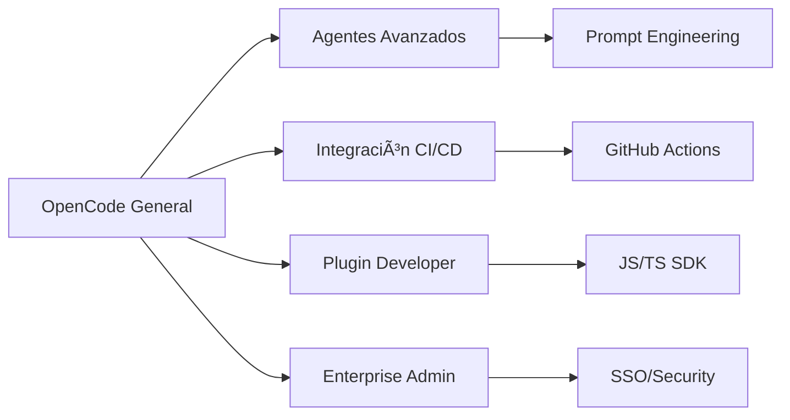

# Módulo 9: Novedades, Troubleshooting y Próximos Pasos

**Objetivo**: Mantenerse actualizado, resolver problemas comunes y planificar los próximos pasos.

---

## Troubleshooting

### Problemas de conexión
```powershell
# Verificar conectividad con el proveedor
opencode doctor

# Probar provider específico
opencode doctor --provider anthropic

# Ver logs detallados
opencode --verbose
```

### Errores comunes
| Problema | Solución |
|----------|----------|
| API Key inválida | Verificar `opencode auth login` |
| Rate limiting | Cambiar a modelo más pequeño o reducir solicitudes |
| Out of tokens | Usar `/compact` para comprimir conversación |
| Error de permisos | Revisar `permissions` en `opencode.json` |
| LSP no funciona | Verificar que el servidor LSP está instalado |

### Modo verbose
```powershell
opencode --log-level debug
```
Muestra información detallada de cada paso que ejecuta OpenCode.

### Diagnóstico de red
```json
{
  "network": {
    "proxy": "http://proxy:8080",
    "timeout": 30000,
    "retries": 3
  }
}
```

---

## Rendimiento y Optimización

### Modelo pequeño (small_model)
```json
{
  "model": "claude-sonnet-4-20250514",
  "small_model": "claude-haiku-3-5-20241022"
}
```
El `small_model` se usa para tareas simples, ahorrando tokens y costos.

### Compactación
```json
{
  "compaction": {
    "enabled": true,
    "strategy": "smart",
    "maxTokens": 32000
  }
}
```
Reduce el contexto automáticamente cuando se acerca al límite.

### Cache
OpenCode cachea resultados de operaciones repetitivas:
- Búsquedas de archivos
- Resultados de LSP
- Metadata de proyectos

---

## Novedades 2026

### Versión actual
OpenCode v1.14.48+ (junio 2026)

### Lo nuevo en 2026
- **Desktop App beta** — Aplicación nativa para macOS, Windows y Linux
- **Multi-sesión** — Múltiples agentes en paralelo
- **MCP mejorado** — Soporte para Streamable HTTP
- **Agent Skills** — Sistema de habilidades reutilizables
- **OpenCode Go** — Plan low-cost con modelos open source
- **GitHub Copilot / ChatGPT Plus** — Login con suscripciones existentes
- **160K+ GitHub stars** — Comunidad masiva
- **7.5M+ developers** mensuales activos

### Roadmap
- OpenCode Zen improvements
- Más proveedores de modelos
- Plugin marketplace oficial
- Mejoras en el SDK
- Enterprise GA

---

## Próximos Pasos

### Rutas de especialización



### Recursos oficiales
| Recurso | URL |
|---------|-----|
| Documentación | [opencode.ai/docs](https://opencode.ai/docs) |
| GitHub | [github.com/anomalyco/opencode](https://github.com/anomalyco/opencode) |
| Discord | [opencode.ai/discord](https://opencode.ai/discord) |
| Changelog | [opencode.ai/changelog](https://opencode.ai/changelog) |
| Models.dev | [models.dev](https://models.dev) |

---

## Resumen de toda la guía

Has completado los **9 módulos** de la guía de OpenCode:

| Módulo | Tema |
|--------|------|
| 1 | Fundamentos y Primeros Pasos |
| 2 | Flujo de Trabajo Básico y Modos de Operación |
| 3 | Agentes: Especialización y Automatización |
| 4 | Personalización y Configuración Avanzada |
| 5 | Integración y Flujos de Trabajo Avanzados |
| 6 | MCP Servers, Skills y Plugins |
| 7 | OpenCode Go, Desktop y Modo Server |
| 8 | Custom Tools, Formateadores y Enterprise |
| 9 | Novedades, Troubleshooting y Próximos Pasos |

---

**Documentación oficial**: https://opencode.ai

**Inicio herramienta**: [[opencode|OpenCode]]
**Inicio principal**: [[../../../00 - Índice/Índice General]]


